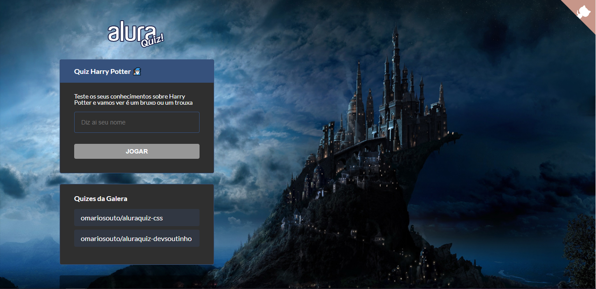

<p align=center>
  
</p>

<h3 align="center">
  <a href="#-sobre">Sobre</a>&nbsp;|&nbsp;
  <a href="#-deploy-online">Deploy online</a>&nbsp;|&nbsp;
  <a href="#-tecnologias-utilizadas">Tecnologias</a>&nbsp;|&nbsp;
  <a href="#-imagens-do-sistema">Imagens do sistema</a>&nbsp;|&nbsp;
  <a href="#-como-usar">Como usar</a>&nbsp;|&nbsp; 
</h3>

## 🗒 Sobre

O **AluraQuiz** é uma aplicação que foi desenvolvido durante o evento imersão Alura, sendo uma aplicação web de quiz.

## 🛠 Deploy online
Para testar a aplicação basta clicar [aqui](https://quiz-git-main.jonathankbp.vercel.app/).

## 🚀 Tecnologias Utilizadas

  * [ReactJS](https://pt-br.reactjs.org)
  * [NextJS](https://nextjs.org/)
  * [Styled components](https://styled-components.com/)
  
## 🖼 Imagens do sistema

**WEB**


## 📦 Como usar

```bash

  #Clonar o repositório
  $ git clone git@github.com:JonathanKBP/Quiz.git

  # Instalar as dependências NPM
  $ npm install 

  # Inciar o projeto
  $ npm start

```

<p align=center> Desenvolvido por Jonathan Kevin 💻 </p>
